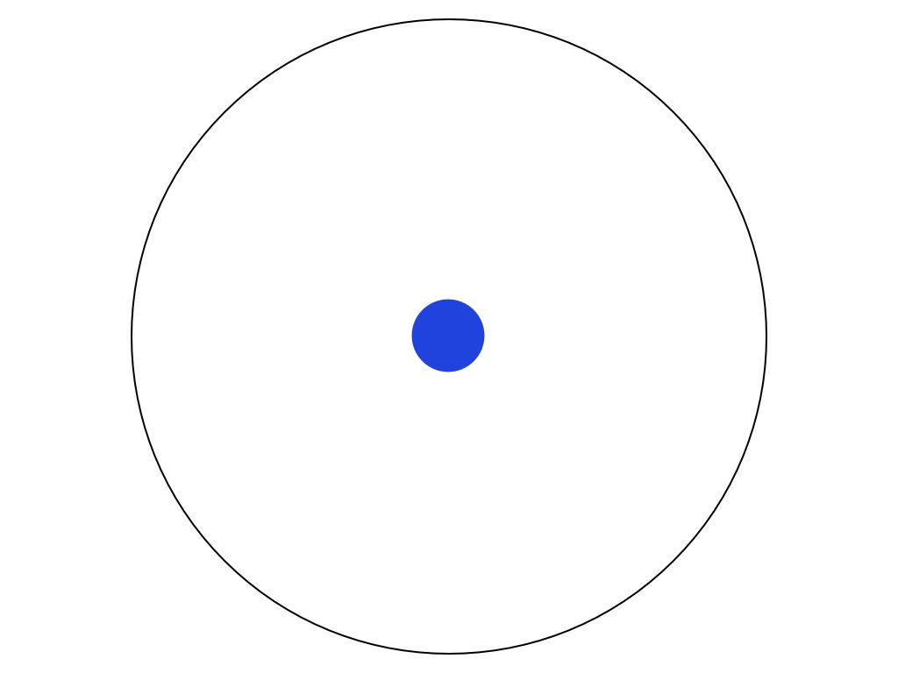
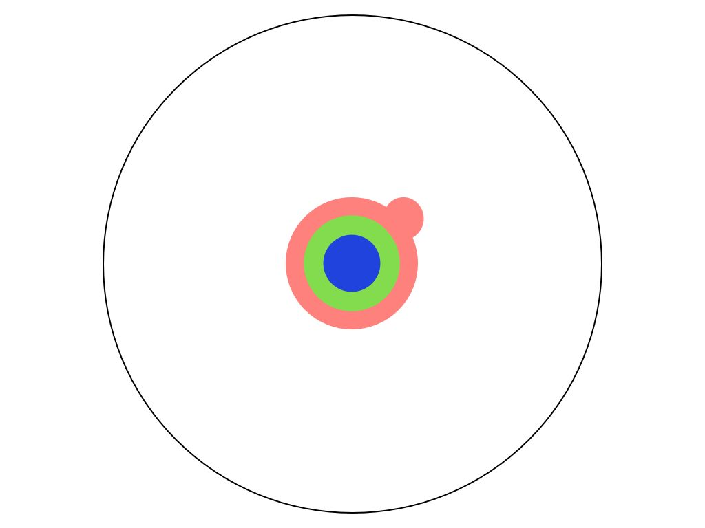
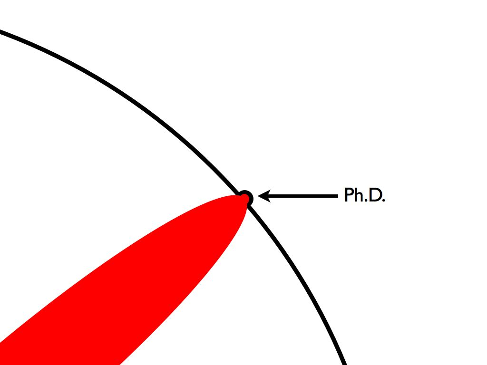
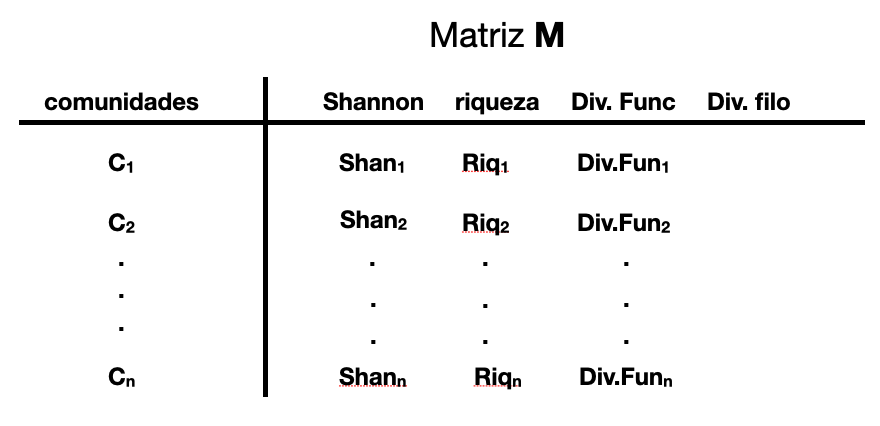
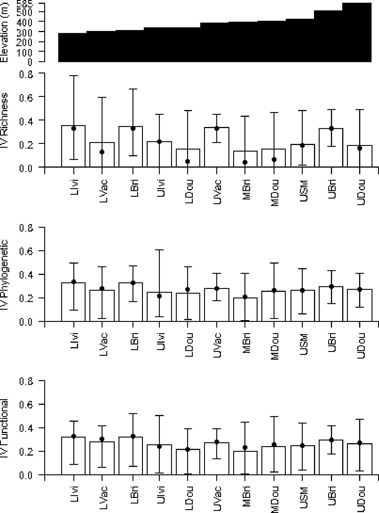
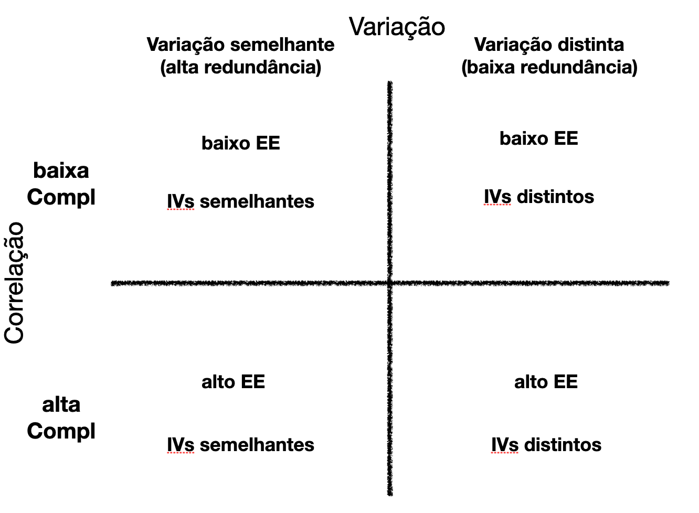
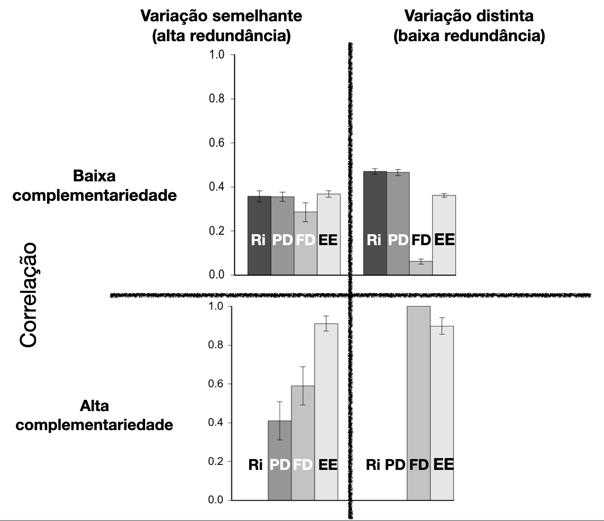

```{r setup, include=FALSE}
options(htmltools.dir.version = FALSE)
knitr::opts_chunk$set(warning = FALSE, message = FALSE, 
  comment = NA, dpi = 300, echo = FALSE,
  fig.align = "center", out.width = "60%", cache = FALSE,
  fig.path = "figs/")
library(tidyverse)
library(gganimate)
ozcols <- wesanderson::wes_palette("FantasticFox1")[c(2:3)]
```

class: title-slide, center, bottom


# `r rmarkdown::metadata$title`

## `r rmarkdown::metadata$subtitle`

### `r rmarkdown::metadata$author` 

### UFC (Professor substituto) &#183; UFRGS (Posdoc)

#### `r params$event` &#183; `r params$date`

---

name: hello
class: inverse, right, bottom


# Você pode me encontrar em...

[`r icon::fa("twitter")` @gabrielnakamur4](http://twitter.com/gabrielnakamur4)  
[`r icon::fa("github")` @GabrielNakamura](http://github.com/GabrielNakamura)  
[`r icon::fa("link")` gabrielnakamura.netlify.app](https://gabrielnakamura.netlify.app)  
[`r icon::fa("paper-plane")` gabriel.nakamura.souza@gmail.com](mailto:gabriel.nakamura.souza@gmail.com)

---
class: inverse, middle, center

# Quem sou eu

```{r, out.width= '30%'}
knitr::include_graphics("images/thisIsBird.jpeg")
```

---

# Um pouco do caminho

```{r, out.width= '70%'}
knitr::include_graphics("images/PhDKnowledge.001.jpg")
```

---

# Graduação

```{r, out.width= '70%'}

```

---

# Graduação

```{r, out.width= '70%'}
knitr::include_graphics("images/PhDKnowledge.003.jpg")
```

---

# Mestrado

```{r, out.width= '70%'}

```

---

# Mestrado

```{r, out.width= '70%'}
knitr::include_graphics("images/PhDKnowledge.005.jpg")
```

---

# Doutorado

```{r, out.width= '70%'}
knitr::include_graphics("images/PhDKnowledge.006.jpg")
```

---

# Doutorado

```{r, out.width= '70%'}
knitr::include_graphics("images/PhDKnowledge.008.jpg")
```

---

# Minha pequena contribuição 

.pull-left[
```{r, out.width= '90%'}

```
]

--
.pull-right[
.center[
.midle[

Gostar de Ecologia sem ter um grupo do `r emo::ji("heart")`

Descrever padrões de biodiversidade em comunidades

```{r, out.width= '60%'}

```

```{r, out.width= '60%'}

```

.center[
```{r, out.width= '40%'}
knitr::include_graphics("images/Logo_FishPhyloMaker.png")
```
]

]
]
]

---
class:middle, center

# Era uma vez, em 2012...

## Uma dissertação para ser feita

--

## Um conjunto de dados de comunidades de peixes

--

## **Uma tentativa de responder uma questão**

---

class: inverse, middle, center

# O que é biodiversidade?

```{r echo=FALSE, out.width="10%"}
knitr::include_graphics("images/lightbulb-color.png")
```

---

class: middle, inverse, center

# Começando pelo fim

## A trajetória Star Wars de investigação


---
class: inverse, middle, center

# Episódio I 

## O Ataque das Métricas

---

# Qual métrica é mais importante?

```{r echo=FALSE, out.width="80%"}

```

---

# A visão de [Ricotta (2005)](https://link.springer.com/article/10.1007/s10441-005-7001-6) `r emo::ji("cheese")`

.pull-left[

```{r echo=FALSE, out.width="80%"}

```

]

--

.pull-right[
.center[
.midle[


*"…biodiversity may be defined simply as a set of **multivariate summary statistics for quantifying different characteristics of community structure**"*


```{r echo=FALSE, out.width="100%"}

```


]
]
]

---

# Calculando a Contribuição das métricas (IVs)

.pull-left[

```{r echo=FALSE, out.width="100%"}

```

.left[
Extensão da proposta de [Wilsey et al 2005](https://esajournals.onlinelibrary.wiley.com/doi/10.1890/04-0394)

```{r echo=FALSE, out.width="20%"}

```

]

]


--

.pull-right[

.center[
```{r echo=FALSE, out.width="100%"}

```

] 

]

---

# Aplicando os IVs para comunidades de `r emo::ji("fish")`

.pull-left[
```{r echo=FALSE, out.width="90%"}

```
]

--

.pull-right[
```{r echo=FALSE, out.width="60%"}

```
]

.center[
**Dimensões *Funcional* e *Filogenética* como mais importantes para representar a diversidade**
]

---
class: center, inverse, middle

# Episódio II

## O EE contra-ataca (Evenness of Eigenvalues)

---

# A proposta de Stevens e Tello (2014, 2019)

.pull-left[
```{r echo=FALSE, out.width="80%"}

```

```{r echo=FALSE, out.width="100%"}

```

]

--

.pull-right[
```{r echo=FALSE, out.width="100%"}

```
]

--

.center[
.midle[

- **Aborda a dimensionalidade através do grau de correlação de diferentes métricas**
- **Dimensionalidade representada em um único valor: <span style="color:red">EE</span> (Evenness of Eigenvalues)**

]
]


---

class: center, inverse, middle

# Episódio III

## O (Re)Despertar da Dimensionalidade (EE + IV)

### Em busca de uma visão unificadora da Dimensionalidade (EE + IV)

---
# Conciliando IVs e EEs

## Dois métodos, uma só história

.center[
.midle[
```{r echo=FALSE, out.width="80%"}

```
]
]

---

# EE nos conta sobre a complementariedade e IV sobre redundância

.pull-left[
## Complementariedade
.center[
.midle[
```{r echo=FALSE, out.width="100%"}

```
]
]
]

--

.pull-right[
## Redundância
.center[
.midle[
```{r echo=FALSE, out.width="100%"}

```
]
]
]

---

# O framework integrado

.center[
.midle[

```{r echo=FALSE, out.width="50%"}

```

]
]

--

1- A abordagem integrativa possibilita maior compreensão da dimensionalidade?

2- Ela realmente funciona?

---

# Testando o framework integrado - Criando comunidades

```{r echo=FALSE, out.width="100%"}
knitr::include_app(url = "https://gabrielnakamura.shinyapps.io/Supp_matShiny/")
```

---

# Testando o framework integrado - Validação das Simulações

.pull-left[
```{r echo=FALSE, out.width="100%"}

```
]

.pull-right[
- Cenário de  **poucas dimensões** e **semelhança na importância das métricas**
- Cenário de **poucas dimensões** e **diferença na importância das métricas**
- Cenário de **muitas dimensões** e **semelhança na importância das métricas**
- Cenário de **muitas dimensões** e **diferença na importância das métricas**
]

---

# Testando o framework integrado - Simulações

```{r echo=FALSE, out.width="40%"}

```

---

# Testando o framework integrado - Mundo Real

```{r echo=FALSE, out.width="70%"}

```

---

# Testando o framework integrado - Mundo Real


```{r echo=FALSE, out.width="70%"}

```

--

- Dimensões taxonômica e filogenética como complementares

--

- Métricas de riqueza e divergência filogenética (PSV) como mais importantes

---

# Com quantas métricas se descreve uma comunidade?

.pull-left[
```{r echo=FALSE, out.width="100%"}

```

]

--

.pull-right[
```{r echo=FALSE, out.width="100%"}

```
]

---
class: center, inverse, middle

# Episódio IV

## A Ascenção Dimensionality (O que há por vir?)

--

- Modelos mecanísticos ligando dimensionalidade e processos macroecológicos e macroevolutivos

- Pacote Dimensionality

.center[
.midle[
```{r echo=FALSE, out.width="100%"}

```

]
]

---
background-image: url(images/sidebar-listing.png)
background-position: left
background-size: contain
class: center, middle, inverse

.pull-right[

 


## Colaboradores

Tema dos slides desenvolvido por [Desirée De Leon](http://desiree.rbind.io/).

Slides criados através do pacote [**xaringan**](https://github.com/yihui/xaringan).

Com o chakra a partir de [remark.js](https://remarkjs.com), [**knitr**](http://yihui.name/knitr), e [R Markdown](https://rmarkdown.rstudio.com).

]

